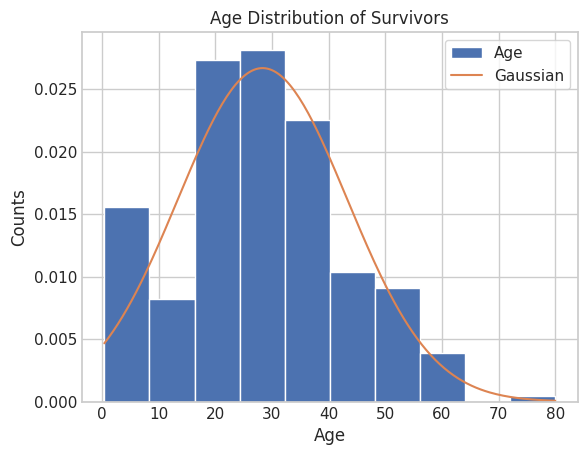
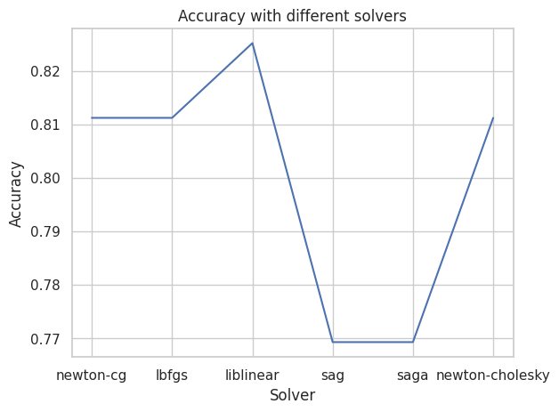
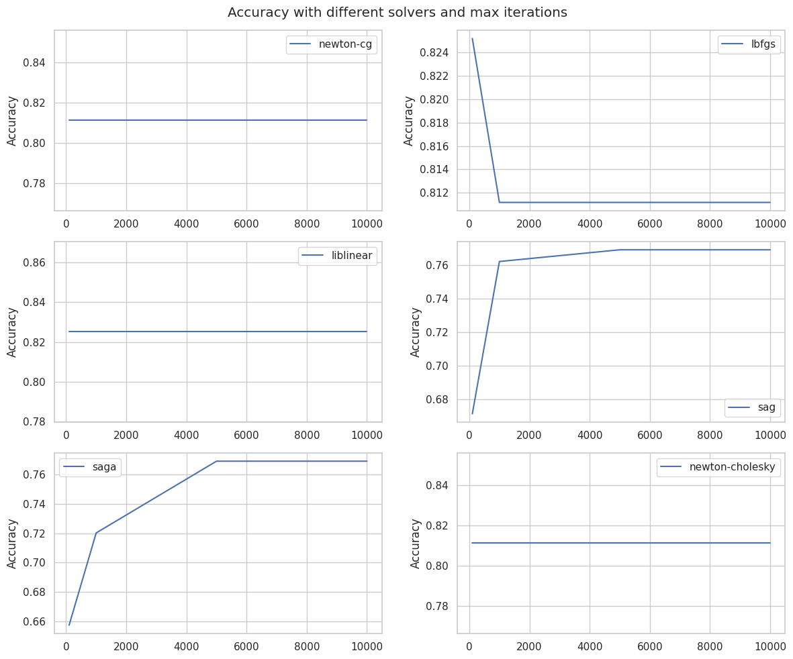
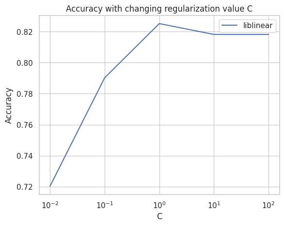
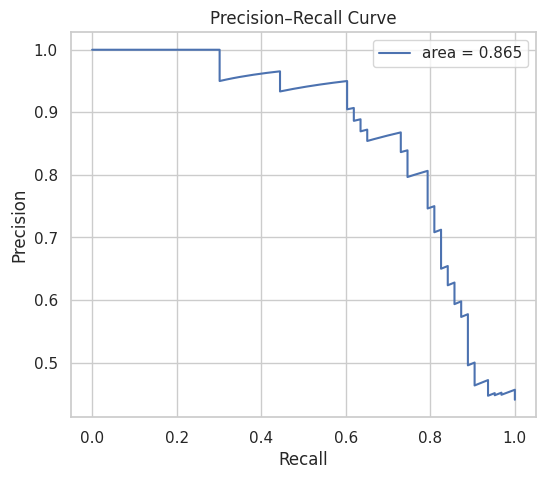

## Project Overview

This project is using the Kaggle ‘Titanic: Machine Learning from Disaster’ data to train a logistic regression meant to predict disaster survivors based on personal attributes. This project was built for learning purposes, and shows the best practices in feature engineering, model training and validation. Lastly, the project aims to highlight and discover potential limitations/improvements of logistic models in classification problems. 

### Data

The data is separated into a train and test file, however only the training data has the neccessary labels for testing. The test file is meant to be used for submitting predictions into Kaggle competitions, the results being tested against their internal results. Therefore, only the ‘train.csv’ file is used for training and validation. 

#### Data types

The dataset contains 11 features and a binary ‘Survived’ label, which the model will try to predict. The table below shows the data types and number of samples.

```python
<class 'pandas.core.frame.DataFrame'>
RangeIndex: 891 entries, 0 to 890
Data columns (total 12 columns):
 #   Column       Non-Null Count  Dtype  
---  ------       --------------  -----  
 0   PassengerId  891 non-null    int64  
 1   Survived     891 non-null    int64  
 2   Pclass       891 non-null    int64  
 3   Name         891 non-null    object 
 4   Sex          891 non-null    object 
 5   Age          714 non-null    float64
 6   SibSp        891 non-null    int64  
 7   Parch        891 non-null    int64  
 8   Ticket       891 non-null    object 
 9   Fare         891 non-null    float64
 10  Cabin        204 non-null    object 
 11  Embarked     889 non-null    object 
dtypes: float64(2), int64(5), object(5)
memory usage: 83.7+ KB
```

#### Data Imbalance

The dataset includes more negative samples.

| **Survived** | **count** |
| --- | --- |
| **0** | 549 |
| **1** | 342 |

#### **Data Investigation**

The age distribution of surviving passangers was investigated, to test prior assumptions. The hypothesis is that younger passangers have a higher survival rate. The population distrubiton is supposed to be gaussian, hence the table below reflects that people aged 0-10 years deviated significantly from the baseline, pointing to a higher chance of survival. 

This behaviour will be discussed in later sections, as the model did not accurately learn this trend. 



#### **Data Cleaning**

The ‘Cabin’ column was discarded as its data was sparse and was a weak signal of survival. Age is a significant feature hence its data was kept, and the dataset was filtered by eliminating rows with missing values. This yielded 712 uniform datapoints. 

#### **Data Preprocessing & Feature Engineering**

The following preprocessing steps were performed: 

1. **Name:** the 'name' data is often a long, unique-valued string. We extracted the useful signals such as the **titles: Mr, Miss, Mrs, Master, Rare.**
2. **Sex:** Encoded ****gender using one-hot encoding and kept only one variable **(Sex_male)**
3. **SibSp & Parch:** Created **'Family_members'** variable by combining 'SibSp' (number of siblings/spouses) and 'Parch' (number of parents/children) to get a stronger signal of relatedness.
4. **Ticket:** Extracted signal from 'Ticket' data showing the number of times the same ticket was used (i.e. groups travelling together).
5. **PassengerId:** Dropped passenger id (useless data)
6. **Embarked:** One-hot-encoded, resulting in 3 features: **Embarked_C, Embarked_S, Embrked_Q**
7. **Age, Fare, Pclass:** no changes applied

Final result: 14 features

### Model

A logistic regression was trained. The model parameters were fine-tuned by experimenting with: regularization, elastic-net ratio, solvers, number of iterations. These test had significant improvements, identifying the following optimal model parameters. 

1. **Solvers**



‘liblinear’ solver had +1% better accuracy. 

1. **Iterations**



The experiment shows which solvers take longer to converge, out of which **liblinear, newton-cg and newton-cholsesky are the most stable**.

1. **Regularization**



Optimal regularisation parameter C=1

1. **Elastic-net regularization**

A different regularization method (elastic-net), included in the ‘saga’ solver was tested, to check for potential performance improvements, however, none were found. 

Optimal model parameters: *solver=’liblinear’, max_iterations=1000, C=1*

### Appendix: Feature Improvements Experiments

Other feature engineering methods were tried in the ‘5.2. Feature improvements section, which yielded no improvements. The following changes were attempted: 

- Reducing the number of male gender signals: eliminating Title → no significant effect (the signal just gets concentrated onto one feature, but no improved learning)
- Handling continuous data: using polynomials, normalisation → small reduction; binning → no change.
- Handling skewed data: applying log-transform on ‘Fare’ prices. → no improvement?
- Adding an ‘Alone’ parameter → nothing (perhaps bc signal is included in ‘Family members’ and ‘TicketGroupSize’

These experiments reflect the low-capacity of logistic regression data fine-tuning. 

Discussion

Removing redundant male signlas did not produce significant results as the model already handles this through regulatization. The information content stays identical, only coefficients get redistributed, adding no predictive power.

The use of polynomial signals made the model worse. The age effect may not follow a clean polynomial, hence forcing that trend, made the model worse. 

Binning had no effect either, since logistic regressions can handle continuous data,

Normalisation usually helps optimisation and stabilises coefficients, so it changes training behaviour more than final accuracy. 

Fare price was a weak-moderate signal, hence the log-tranform did not improve the model. The logic was the this operation will improve socio-economic separability, but this is already included in Pclass. Again, not ‘knowledge’ was added.

**Conclusion: FE improvements should ADD information, not repackage existing knowledge.**

### Validation

To get a robust evaluation of model performance, different cross-validation procedures were used. 

The model performance after **cross-validation** was **81.4% ± 3.2%,** indicating significant variability. 

The dataset is small enough that sampling matters, the stratified k-fold method was used, which resulted in a performance of **82.2% ± 3.7%**, which is closer to the mean accuracy of liblinear.

Lastly, the leave-one-out technique was used to overcome the limitations of a small dataset, however this naturally leads to more variability, since the model is validated on one sample. This gave a result closer to that 82% seen in Experiment#1 : **82.4% ± 3.8%.**

### Evaluation & Discussion

This section is looking at other evaluation parameters -**confusion matrix, precision-recall, f1 score and support** to describe the model. 

This shows that the model has a **negative bias**, due to the presence of more negative samples in the training data. When the model predicts a death it is correct 81% of the time, but out of all the passengers who actually died it found 88% of them, signialignt hat the model may have overfitted on negative samples. 

This bias influences positive predictions. Out of all positive predictions, 82% are correct, but out of all survivors, only 75% are identified. Showing that the model replaces some positive predictions with negative ones (negative bias).

The ROC-AUC is 84.4%, while the precision-recall area is 86.5%, which signals a good predictive power, but is slightly imbalanced. 



Last, but not least - by analysing the model weights, intercept and convergence we can try to better understand what the model learned/prioritised. 

- **Negative coefficients -> decrease probability of survival / Positive coefficients -> increase probability of survival**
- **Strong negatives:** gender (Sex_male = -3.60), class, miss (slightly negative which does not make sense really), ticket group size (larger groups have slightly reduced survival), family_member and age (both of which are unexpectedly negative). -**Strong positives**: master (child), embarkation location, mrs title, rare titles, mr (surprisingly), fare (very small, it would make sense to be alrger)
- **Continous variables: 'Age' & 'Fare'** have small coefficients to stabalise the absolute values. The coefficients do not reflect the contribution of these features to the survival probability, sincethe contribution to the loss function is scales by the real vale of age/fare as $x_i∗w_i$ . The signs of the coefficients are important here - age is negative (older people have lower survival prob), fare is positive (more expensive rates have higher survival prod).
- **Model convergence**: 18 iterations, which is relatively fast, indicating that the optimization process is stable.
- **Intercept:** strongly positive to maybe counter-act the effect of many negative predictors.

**Comparison with other models**

A shallow decision tree and a shallow random forest classifier gave accuracies of 79.7% and 80.4%, respectively, slightly lower than the fine-tuned regression. 

### Conclusion
